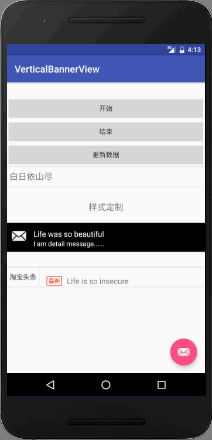

### VerticalBannerView

`VerticalBannerView`是一个android平台下的自定义控件,通常用来展示广告,类似`淘宝头条`,它的样式如下:



### Feature

1. 可自由定义展示的内容
2. 使用方式类似ListView/RecyclerView
3. 可为当前的内容添加各种事件,比如点击打开某个页面等

### Attention

API >= 11

### Usage

可以类比`ListView`

0. 添加依赖

    - Add it in your root build.gradle at the end of repositories:

        ```
        
            allprojects {
                repositories {
                    ...
                    maven { url "https://jitpack.io" }
                }
            }
        ```
    - Add the dependency
        
        ```
        dependencies {
        	        compile 'com.github.Rowandjj:VerticalBannerView:1.0'
        	}
        ```


1. 定义item的布局
    
    ```
    <?xml version="1.0" encoding="utf-8"?>
    <RelativeLayout xmlns:android="http://schemas.android.com/apk/res/android"
                  android:orientation="vertical"
                  android:layout_width="match_parent"
                  android:background="#000"
                    android:gravity="center_vertical"
                  android:layout_height="60dp">
    
        <ImageView
            android:layout_marginLeft="10dp"
            android:id="@+id/iv"
            android:src="@android:drawable/ic_dialog_email"
            android:layout_width="30dp"
            android:layout_height="30dp"
            />
    
        <TextView
            android:id="@+id/tv_02"
            android:text="hello world"
            android:layout_marginLeft="10dp"
            android:textSize="16sp"
            android:layout_toRightOf="@id/iv"
            android:paddingLeft="5dp"
            android:textColor="#fff"
            android:layout_width="match_parent"
            android:layout_height="wrap_content"/>
    
        <TextView
            android:layout_below="@id/tv_02"
            android:text="I am detail message......"
            android:layout_marginLeft="10dp"
            android:textSize="14sp"
            android:layout_centerVertical="true"
            android:layout_toRightOf="@id/iv"
            android:paddingLeft="5dp"
            android:textColor="#fff"
            android:layout_width="match_parent"
            android:layout_height="wrap_content"/>
    </RelativeLayout>
    ```

2. 实现adapter

    ```
    public class SampleAdapter01 extends BaseBannerAdapter<Model01> {
    
        private List<Model01> mDatas;
    
        public SampleAdapter01(List<Model01> datas) {
            super(datas);
        }
    
        @Override
        public View getView(VerticalBannerView parent) {
            return LayoutInflater.from(parent.getContext()).inflate(R.layout.item_01,null);
        }
    
        @Override
        public void setItem(final View view, final Model01 data) {
            TextView tv = (TextView) view.findViewById(R.id.tv_01);
            tv.setText(data.title);
            //你可以增加点击事件
            view.setOnClickListener(new View.OnClickListener() {
                @Override
                public void onClick(View v) {
                    //比如打开url
                    Toast.makeText(view.getContext(),data.url,Toast.LENGTH_SHORT).show();
                }
            });
        }
    }
    ```

3. 在布局中增加view的声明

    ```
       <com.taobao.library.VerticalBannerView
                android:id="@+id/banner_01"
                android:layout_width="match_parent"
                android:layout_height="40dp"
                app:animDuration="900" ---->动画间隔900ms
                app:gap="2000"/> ----->切换时长2000ms
    ```

4. 设置Adapter并启动

    ```
    List<Model01> datas02 = new ArrayList<>();
    datas02.add(new Model01("Life was so beautiful","--->Life was so beautiful,"));
    datas02.add(new Model01("From morning to evening","--->From morning to evening"));
    datas02.add(new Model01("We enjoyed the road to school","--->We enjoyed the road to school,"));
    datas02.add(new Model01("Birds chirped and Peace lingered","--->Birds chirped and Peace lingered"));
    final SampleAdapter02 adapter02 = new SampleAdapter02(datas02);
    final VerticalBannerView banner02 = (VerticalBannerView) findViewById(R.id.banner_02);
    banner02.setAdapter(adapter02);
    banner02.start();
    ```

5. 更新数据

    ```
    List<Model01> newData = new ArrayList<>();
    newData.add(new Model01("锄禾日当午","--->锄禾日当午"));
    newData.add(new Model01("汗滴禾下土","--->汗滴禾下土"));
    newData.add(new Model01("谁知盘中餐","--->谁知盘中餐"));
    newData.add(new Model01("粒粒皆辛苦","--->粒粒皆辛苦"));
    adapter02.setData(newData);
    
    ```
    
6. 停止

    ```
    banner02.stop();
    ```
